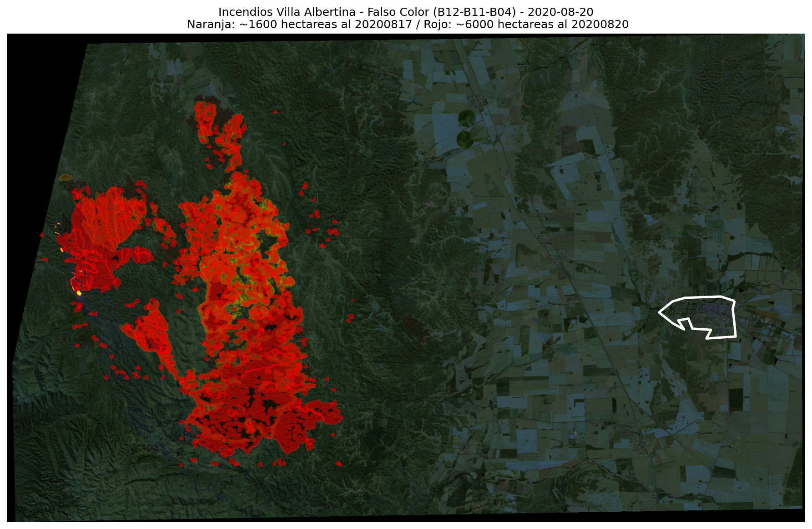
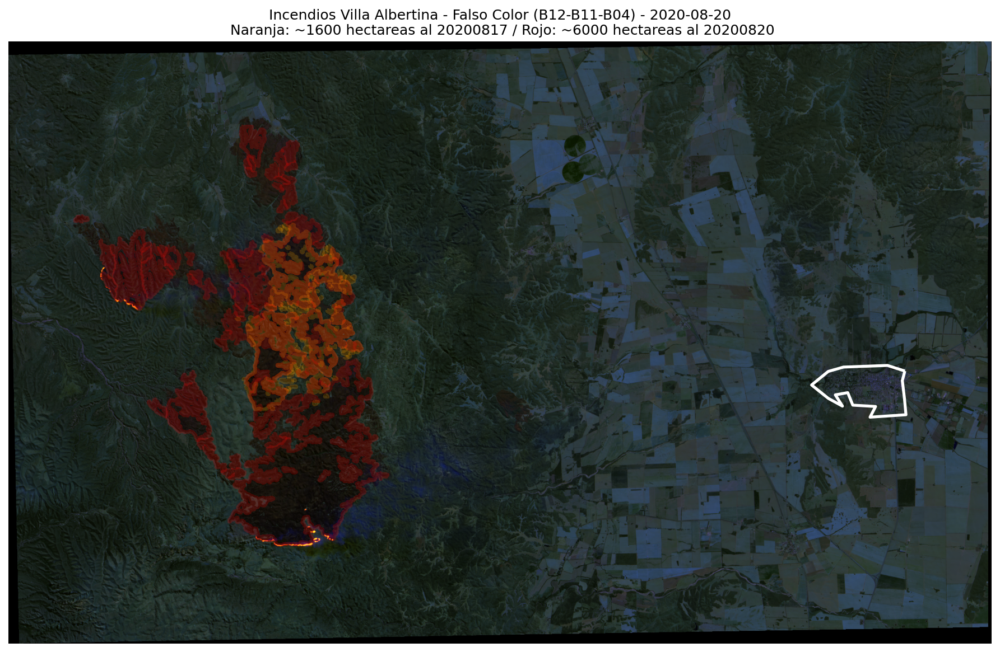

# Incendios Villa Albertina

Repositorio con imágenes satelitales relacionadas a la evolución de los incendios de villa albertina 2020-08-15/2020-08-22

### Imagenes 

Las imagenes correponden a:
- S2A_MSIL2A_20200822T141051_N0214_R110_T20JLM_20200822T182240.zip
- S2B_MSIL2A_20200820T141739_N0214_R010_T20JLM_20200820T182855.zip
- S2A_MSIL2A_20200815T141741_N0214_R010_T20JLM_20200815T182929.zip
- S2B_MSIL2A_20200817T141049_N0214_R110_T20JLM_20200817T163953.zip

obtenidas desde https://scihub.copernicus.eu (via sentinelsat api).

### 2020-08-20 

A modo de referencia se incluye a mano derecha el contorno de [Villa del Totoral](https://es.wikipedia.org/wiki/Villa_del_Totoral).

Incluimos la imagen solo en falso color, con la zona con incendios demarcada:

### 2020-08-20 

A modo de referencia se incluye a mano derecha el contorno de [Villa del Totoral](https://es.wikipedia.org/wiki/Villa_del_Totoral).

Incluimos la imagen solo en falso color, con la zona con incendios demarcada:

Una estimación (muy aproximada mas detalles en [jnb](Incendios_Villa_Albertina.ipynb)) da una superficie afectada cercana a las 6000 
hectareas (como referencia el ejido de villa del totoral tiene 720 hectareas)

### 2020-08-17 

A modo de referencia se incluye a mano derecha el contorno de [Villa del Totoral](https://es.wikipedia.org/wiki/Villa_del_Totoral).

Incluimos la imagen solo en falso color, con la zona con incendios demarcada:

Una estimación (muy aproximada mas detalles en [jnb](Incendios_Villa_Albertina.ipynb)) da una superficie afectada cercana a las 1700 hectareas (como referencia el ejido de villa del totoral tiene 720 hectareas)

### 2020-08-15

En las imagenes correspondientes al dia 15 ya se observaba ciertos focos activos.

